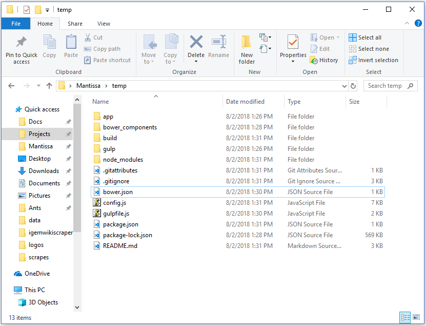

# generator-igemwiki

This tool is heavily inspired by Julian Mazzitelli's (iGEM Toronto 2016) [generator-igemwiki](https://github.com/igemuoftATG/generator-igemwiki), uses much of his code, builds on much of his work, and is an attempt at providing a stable and easily community-maintained package. Shout-out to Julian for making this tool a possibility and being an overall awesome guy.

## Description

`generator-igemwiki` is a [Yeoman generator](http://yeoman.io/); a tool that creates scaffolds for iGEM Wikis for use with Virginia 2018's wiki build tool, [igem-wikibrick](https://github.com/Virginia-iGEM/igem-wikibrick).

In english: `generator-igemwiki` makes creating a professional, high-quality iGEM Wiki quickly and easily. The tool provides you with a highly flexible template that can be edited locally and offline; changes are rendered instantly in your web browser, and all files can be uploaded automatically to the iGEM wiki.

TODO: Depending on experience level and ambition, different extensions to the scaffold will be available in the future which can bring teams closer to their goal. The most simple scaffold uses pure HTML, CSS, JavaScript, and regular old images and fonts. We've added optional extensions such as Handlebars which can be used for pre-publish templating, and vendor packages like JQuery which can be used for live templating. Frameworks like Bootstrap, Bulma and Material can be added on that can simplify the process of web development for those who are new to programming. Preprocessors and postprocessors can be added such as SASS, Autoprefixer and minifiers that make writing clean, readable code faster.

## Quickstart

For those who already have Node installed, know of Git and know their terminal:

```bash
npm install -g npm
npm install -g yo bower gulp@next https://github.com/Virginia-iGEM/generator-igemwiki
mkdir igem-2018-wiki
cd igem-2018-wiki
yo igemwiki
```

If that made no sense, please continue on to [Installation and Setup](#installation-and-setup) for a full walkthrough.

## Installation and Setup

First, you must download and install the latest version of [Node.js](https://nodejs.org/en/) if you do not already have it installed. Node.js is a JavaScript interpreter (similar to the Python interpreter) that we use to run both the generator as well as to build the project.

Once you've downloaded Node.js, launch a terminal. On Windows, Powershell is our terminal of choice (Start Menu > Search > Powershell); as far as we are aware, cmd.exe will work as well, but we reccommend Powershell. On Mac, we reccommend [iTerm2](https://www.iterm2.com/), though the built-in Terminal should work just fine. On Linux, any modern BASH-like shell should work.

> If you are nervous about using the terminal, we have written a short [Introduction to the Terminal](https://github.com/Virginia-iGEM/2018-tutorials/tree/master/cli) article, specifically aimed at iGEM students.

Now, we'll update `npm`, the Node.js package manager (like `apt` or `pip`) to the latest version; install `yo`, Yeoman; install `bower`, our live dependency manager; install `gulp@next`, gulp v4.0, which is the command-line task runner our build system uses; and `generator-igemwiki`, which is of course this generator:

```bash
npm install -g npm    # update npm to latest version
npm install -g yo bower gulp@next
npm install https://github.com/Virginia-iGEM/generator-igemwiki
```

Several pages of information should be logged. If these commands complete without errors, proceed to create a new folder that will hold all the code for your wiki. For example, mine is located in `C:\Users\Mantissa\Projects\igem-2018-wiki`; place it somewhere easy to access, such as your Documents, Desktop, or your Home folder on Unix.

If you'd like to do this through the terminal, the following series of commands should work:

```bash
cd ~                  # change dir to home
cd Documents          # optional; `cd Desktop` or `cd Projects` would also be good
mkdir 2018-igem-wiki  # replace 2018 with your year, of course
```

Now, we're going to enter this directory with the terminal. `cd` into  the project folder:

```bash
cd ~/Documents/2018-igem-wiki   # This will take you to C:\Users\<your-username>\Documents\2018-igem-wiki
```

And once we're in the project folder, run `yo`:

```bash
yo igemwiki
```

This will prompt you for the current iGEM year, your team name (this must be **exactly** identical to how it appears on the URL of your wiki, including capitalization and punctuation. If it is not, the tool will not be able to upload your files and you will have to edit `config.js` later on), your name and email, and lastly a GitHub repository for your wiki.

---

A short aside: at this point, if you haven't already, we **strongly** reccommend you start using Git to manage your project:

- [Download and install Git](https://git-scm.com/)
- Set up a [GitHub account](https://github.com/join) and a [GitHub organization for your team](https://www.sap.com/developer/tutorials/webide-github-creating-org.html)
- [Create a new GitHub repository for your wiki](https://help.github.com/articles/create-a-repo/). Note, when creating a new repository, do **NOT** check the **Initialize this repository with a README**, even if the instructions say to, as we will be pushing an existing repository to GitHub later on.

Your project should now show up on the page for your GitHub repository.

While this may seem like a lot of setup, it doesn't take that long and learning to use Git and GitHub will save you a lot of strife in the long run. If you've never heard of it before, Git is a Version Control System; this means that it keeps track of every `commit` you make to your project. Every `commit` is a collection of changes, which may mean modificatiosn to files, new files, or deleted files. Because it keeps track of these changes, Git can restore deleted files, or revert to old code in the event that a change was made that turned out to be unwanted. In the event that your computer is destroyed or rendered inoperable, not only can other teammates keep a copy of all changes on their computer, but GitHub also has a copy of the changes and the project can be restored once your computer is working again.

Git has many other features beyond this, including enabling multiple teammates to sanely work on the same file at the same time, branches, which allow team members to split the codebase and merge later on to work on different features without trampling each others' work, and support for cloning and forking, which allows other teams to make use of your repository. We encourage you to read about these features and further understand Git as you use it.

If you do not use Git, or some other version control system, you may find yourself losing work, or perhaps your entire wiki without the ability to recover.

If you do not intend to use Git (not reccommended), or are using some other kind of Version Control System, you can disable this (required) prompt with the `--skip-repo` flag.

---

Back to the tutorial. Once `yo igemwiki` finishes running, it will have created a bunch of folders in your project folder; it should look something like this:



Currently only one template is available, and it is a mirror of the Virginia iGEM Wiki on August 2nd, 2018 at 3:01pm. In the future, we will add more generic templates with varying feature sets.

This generated project has the following properties:

- Development dependencies (external libraries needed for you to develop your wiki on your computer) are managed by `npm`; they are tracked in `package.json` and `package-lock.json`, and can be found in `node_modules`. If you need to install any new development dependencies, do so with `npm install -D <pakagename>` within your project folder.
- Live dependencies (external dependencies that need to be uploaded to the iGEM wiki to work) are managed by `bower`; they are tracked in `bower.json` and can be found in `bower_components`. If you need to install a package which must be uploaded to the iGEM wiki, you can do so with `bower install <packagename>`.
- The project uses Virginia 2018's home-made build tool, `igem-wikibrick`, which in turn makes use of Toronto 2016's `igemwiki-api`. What this means is that, like a C++ project, this project must be built to produce usable HTML, JS and CSS files. To do this, we use the commandline tool, `gulp`.
- Custom `gulp` subtasks can be added to the gulp/unit folder. Note the example `dummy` task.
- Custom `gulp` tasks dependent on other gulp tasks can be added to `gulpfile.js`

At this point, you've installed all the necessary packages, and set up your project, and you can start working.

Before you move on, if you haven't already, you should commit your changes to Git and push to your repository:

- `git init` in your project folder to create a new GitHub repository
- `git add .` to add all the files currently in the repository
- `git commit -m "Initial commit"` to create your first commit
- `git remote add origin https://github.com/username/reponame` to link your repository to GitHub
- `git push -u origin master` to push your information to GitHub

## Usage

Once the project is set up, you are ready to use `igem-wikibrick`, our build-and-upload tool. See the [igem-wikibrick tutorial](https://github.com/Virginia-iGEM/igem-wikibrick/tree/master/docs/tutorial)

## Documentation?

You might be thinking "For a tool this complex, this page is awfully sparse on documentation."

Because this is just a _generator_ wrapped around `igem-wikibrick`; most of our documentation and usage guides, including a detailed usage tutorial, migration guide, and programmer's guide with tool architecture, can be found on the [igem-wikibrick repository](https://github.com/Virginia-iGEM/igem-wikibrick/).

## Contributing

If you're interested in JavaScript, Handlebars, Markdown, Webpack, templating libraries like Handlebars, view libraries like React.js or Angular, and the future of frameworks support the iGEM wiki, and would like to contribute to the tools used to make the `igemwiki` stack run, we welcome pull requests, issue submissiosn and emails at [virginia.igem@gmail.com](mailto:virginia.igem@gmail.com).

If you are on an iGEM team, helping us by submitting issues, or forking and pull requesting can count towards a collaboration for your team.

Links to repositories that make this tool work:

- [igem-wikibrick](https://github.com/Virginia-iGEM/igem-wikibrick), the beating heart of this generator, which supports uploading, browsersync and building.
- The original [igemwiki-api](https://github.com/igemuoftATG/igemwiki-api), written by Toronto 2016's Julian Mazzitelli
  - Our fork of [igemwiki-api](https://github.com/Virginia-iGEM/igemwiki-api), which fixes a few bugs with Julian's code and may be pulled in the future. `igem-wikibrick` runs off of this library.